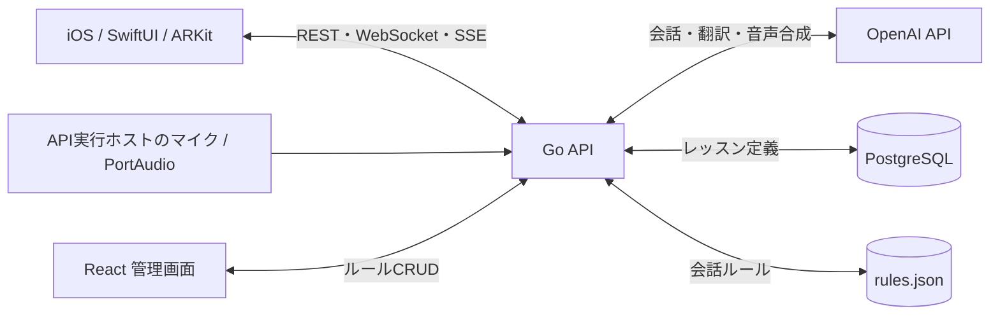

# TALE

TALEは、ARキャラクターとのリアルタイム音声会話を通じて、日本語と日本文化を体験的に学ぶiOSアプリケーションです。旅館や飲食店など、旅行者が戸惑いやすい場面をレッスンとクエストに変え、座敷わらしのガイドが音声・字幕・ARアニメーションを組み合わせて案内します。

## 主な機能

- OpenAI Realtime APIを利用した音声会話
- ARKit / RealityKitによるキャラクター表示と空間演出
- 日本語・英語・中国語・韓国語・フランス語・スペイン語への対応
- PostgreSQLに保存したレッスン定義とステップ進行
- WebSocket / Server-Sent Eventsによる音声・字幕・ARアクションの配信
- 会話ルールとARアクションを編集する管理Web UI

## システム構成



Go APIは会話のステップ・発話テキスト・AR指示を関連付けたイベントを配信します。iOSはステップ種別に応じてWebSocketとSSEの音声経路を選びます。レッスン進行は外部I/Oから分離した `lesson.Session` が担当します。

詳細図: [コンポーネントと通信経路](docs/system-architecture.md) · [PostgreSQLのER図](docs/data-model.md) · [レッスン進行のUMLシーケンス図](docs/lesson-sequence.md)。UML図の編集用ソースは[PlantUML形式](docs/lesson-sequence.puml)です。

### 設計判断とトレードオフ

| 判断 | 理由 | 現在の制約 |
| --- | --- | --- |
| レッスン定義をPostgreSQL、進行ロジックを `lesson.Session` に分離 | ステップ順とARアクションをデータとして管理し、進行条件をDBやHTTPなしで単体テストできる | 進行状態は `lesson_id` ごとのメモリ保持で、同じレッスンを使う複数利用者の状態を分離できない |
| ARアクションをマスターテーブルに置き、ステップから外部キーで参照 | 同じアニメーション指示を複数ステップで再利用できる | 1ステップが直接参照できるアクションは1件で、`params` の内容はDBで種類別に検証していない |
| 会話イベントにステップとAR指示を含め、字幕・音声をWebSocket / SSEで配信 | iOSが表示・動作を会話ステップに結び付けられる | 2つの配信経路の完全な時刻同期や再送保証はない。iOS側でステップ別に再生経路を選んでいる |
| 会話ルールを管理画面から編集し、JSONファイルに保存 | ローカル開発でルールの追加・修正を素早く試せる | 管理APIに認証がなく、複数プロセスでの同時編集を想定していない |

### 失敗からの改善

ここでは、履歴で確認できる初期実装の課題と、その後の修正を記載します。障害発生件数や性能改善率は計測していないため記載しません。

| 初期実装の課題 | 行った改善 | 根拠 |
| --- | --- | --- |
| WebSocketが任意のブラウザOriginを許可し、HTTPサーバーに明示的な終了処理がなかった | 同一Originまたは許可リストに限定し、タイムアウト・セキュリティヘッダー・graceful shutdownを追加 | [変更履歴](https://github.com/furupuraofficial/tale/commit/66be7b9dbd1b5390fe9c519cd80c09c42cc9e848) · [実装](services/api/internal/ar/server.go) |
| iOSの接続先設定が `BackendClient` 内にあり、URLの形式を十分に検証していなかった | 設定処理を独立させ、環境変数・Info.plistの優先順位とURL妥当性をテストした | [変更履歴](https://github.com/furupuraofficial/tale/commit/74fdb0ac56f4fd150257fa14fe01da5a90875c19) · [実装](apps/ios/TALE/ViewModels/Backend/BackendConfiguration.swift) |
| Gemini経路が旧SDKに依存していた | サポート対象のSDKへ移行し、設定に関するテストを追加 | [変更履歴](https://github.com/furupuraofficial/tale/commit/33bc757e55e8c1ed35aa39e6500e5fc6e6510419) · [テスト](services/api/internal/realtime/gemini_config_test.go) |

## リポジトリ構成

```text
.
├── apps/
│   ├── ios/          # SwiftUI / ARKit クライアント
│   └── admin-web/    # React 管理画面
├── docs/              # 構成図・ER図・UML図
└── services/
    └── api/          # Go API / 音声処理 / PostgreSQL
```

## 技術スタック

| 領域 | 技術 |
| --- | --- |
| iOS | Swift, SwiftUI, ARKit, RealityKit, AVFoundation |
| Backend | Go, WebSocket, SSE, PortAudio |
| AI | OpenAI Realtime API, Whisper, Text-to-Speech, Gemini |
| Data | PostgreSQL, Docker Compose |
| Admin | React, Vite, Vitest, Testing Library |

## セットアップ

### Backend

必要要件はGo、PortAudio、Docker（レッスン機能を使う場合）です。

```bash
cd services/api
cp .env.example .env
# .env に OPENAI_API_KEY を設定
docker compose up -d
make run
```

APIキーを利用するため、実行前に各サービスの利用条件と課金設定を確認してください。詳細は[Backend README](services/api/README.md)を参照してください。

### Admin Web

Node.js 22.12以上が必要です。

```bash
cd apps/admin-web
cp .env.example .env
npm ci
npm run dev
```

### iOS

```bash
open apps/ios/TALE.xcodeproj
```

AR機能の確認にはARKit対応の実機が必要です。詳細は[iOS README](apps/ios/TALE/README.md)を参照してください。

## テスト

```bash
cd services/api && go test ./...
cd apps/admin-web && npm run lint && npm test && npm run build
# apps/ios では README 記載のxcodebuild testを実行
```

## 現在の制約

- 音声会話の実行には外部AIサービスのAPIキーが必要です。
- 現状の音声入力はAPI実行ホストのマイクを使います。iOS端末からGo APIへのマイク音声送信は未実装です。
- AR体験はiOSシミュレーターだけでは完全に確認できません。
- アクティブなレッスンセッションは `lesson_id` をキーにインメモリで保持するため、複数利用者で同一レッスンを同時進行できません。
- 管理画面はローカル開発環境での利用を前提とし、ルール管理APIに認証はありません。

改善内容はIssueと小さなブランチ単位で管理します。

## コントリビューションとセキュリティ

開発手順と素材追加時のルールは[CONTRIBUTING.md](CONTRIBUTING.md)、脆弱性の報告方法は[SECURITY.md](SECURITY.md)を参照してください。

## ライセンス

ソースコードは[MIT License](LICENSE)で公開します。3Dモデル、画像、音声などのメディア資産はMIT Licenseの対象外です。詳細は[ASSET_NOTICES.md](ASSET_NOTICES.md)を参照してください。
