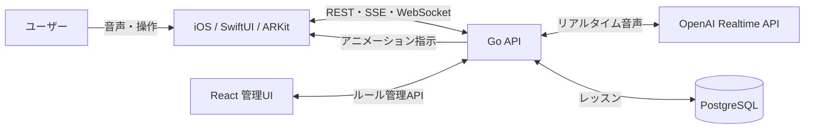

# TALE

TALEは、ARキャラクターとのリアルタイム音声会話を通じて、日本語と日本文化を体験的に学ぶiOSアプリケーションです。旅館や飲食店など、旅行者が戸惑いやすい場面をレッスンとクエストに変え、座敷わらしのガイドが音声・字幕・ARアニメーションを組み合わせて案内します。

## 主な機能

- OpenAI Realtime APIを利用した低遅延の音声会話
- ARKit / RealityKitによるキャラクター表示と空間演出
- 日本語・英語・中国語・韓国語・フランス語・スペイン語への対応
- PostgreSQLに保存したレッスンとステップ進行
- WebSocket / Server-Sent Eventsによる音声・字幕・ARアクションの同期
- 会話ルールとARアクションを編集する管理Web UI

## システム構成



会話状態とARアクションを同じレスポンスとして扱うことで、発話内容とキャラクターの動作がずれない構成にしています。レッスン進行ロジックは外部I/Oから分離し、単体テストできるようにしています。

## リポジトリ構成

```text
.
├── apps/
│   ├── ios/          # SwiftUI / ARKit クライアント
│   └── admin-web/    # React 管理画面
└── services/
    └── api/          # Go API / 音声処理 / PostgreSQL
```

## 技術スタック

| 領域 | 技術 |
| --- | --- |
| iOS | Swift, SwiftUI, ARKit, RealityKit, AVFoundation |
| Backend | Go, WebSocket, SSE, PortAudio |
| AI | OpenAI Realtime API, Whisper, Text-to-Speech, Gemini |
| Data | PostgreSQL, Docker Compose |
| Admin | React, Vite, Vitest, Testing Library |

## セットアップ

### Backend

必要要件はGo、PortAudio、Docker（レッスン機能を使う場合）です。

```bash
cd services/api
cp .env.example .env
# .env に OPENAI_API_KEY を設定
docker compose up -d
make run
```

APIキーを利用するため、実行前に各サービスの利用条件と課金設定を確認してください。詳細は[Backend README](services/api/README.md)を参照してください。

### Admin Web

Node.js 22.12以上が必要です。

```bash
cd apps/admin-web
cp .env.example .env
npm ci
npm run dev
```

### iOS

```bash
open apps/ios/TALE.xcodeproj
```

AR機能の確認にはARKit対応の実機が必要です。詳細は[iOS README](apps/ios/TALE/README.md)を参照してください。

## テスト

```bash
cd services/api && go test ./...
cd apps/admin-web && npm run lint && npm test && npm run build
# apps/ios では README 記載のxcodebuild testを実行
```

## 現在の制約

- 音声会話の実行には外部AIサービスのAPIキーが必要です。
- AR体験はiOSシミュレーターだけでは完全に確認できません。
- アクティブなレッスンセッションは現在インメモリで保持しています。
- 管理画面はローカル開発環境での利用を前提としています。

制約を隠さず記載し、改善内容はIssueと小さなブランチ単位で管理します。

## ライセンス

ソースコードは[MIT License](LICENSE)で公開します。3Dモデル、画像、音声などのメディア資産はMIT Licenseの対象外です。詳細は[ASSET_NOTICES.md](ASSET_NOTICES.md)を参照してください。
