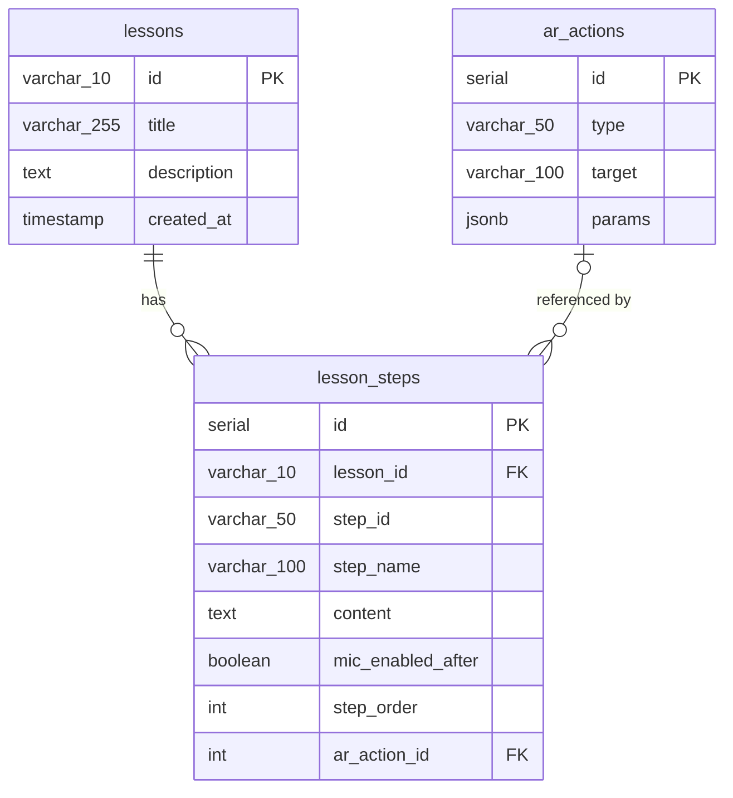

# レッスンのER図

`services/api/migrations/001_create_lessons.sql` と `002_create_ar_actions.sql` を適用した後のPostgreSQLスキーマです。

- `lesson_steps.lesson_id` は必須で、レッスン削除時はステップも削除されます。`(lesson_id, step_id)` に一意制約があり、取得時は `step_order` 順に並べます。`step_order` 自体には一意制約がありません。
- `lesson_steps.ar_action_id` は任意です。1ステップから参照できるARアクションは最大1件で、1件のARアクションを複数ステップから再利用できます。アクション削除時は参照が `NULL` になります。
- `ar_actions.params` はJSONBです。アクションの種類ごとに異なるパラメータを保存できますが、種類別の構造はDB制約で検証していません。
- 会話ルールは `configs/rules.json`、レッスンセッションはプロセス内のメモリにあり、このER図の対象外です。

関連図: [システム構成](system-architecture.md) · [レッスン進行のUMLシーケンス図](lesson-sequence.md)
