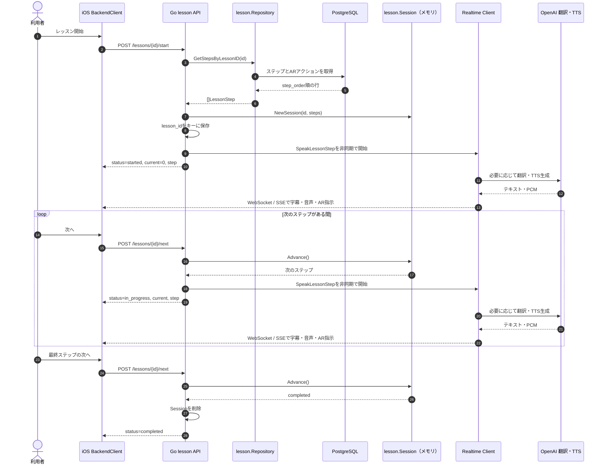

# レッスン進行のUMLシーケンス図

GitHub上で確認できるプレビューです。編集用のPlantUMLソースは [lesson-sequence.puml](lesson-sequence.puml) にあります。

```mermaid
sequenceDiagram
    autonumber
    actor Learner as 利用者
    participant IOS as iOS BackendClient
    participant API as Go lesson API
    participant Repo as lesson.Repository
    participant DB as PostgreSQL
    participant Session as lesson.Session（メモリ）
    participant RT as Realtime Client
    participant AI as OpenAI 翻訳・TTS

    Learner->>IOS: レッスン開始
    IOS->>API: POST /lessons/{id}/start
    API->>Repo: GetStepsByLessonID(id)
    Repo->>DB: ステップとARアクションを取得
    DB-->>Repo: step_order順の行
    Repo-->>API: []LessonStep
    API->>Session: NewSession(id, steps)
    API->>API: lesson_idをキーに保存
    API->>RT: SpeakLessonStepを非同期で開始
    API-->>IOS: status=started, current=0, step
    RT->>AI: 必要に応じて翻訳・TTS生成
    AI-->>RT: テキスト・PCM
    RT-->>IOS: WebSocket / SSEで字幕・音声・AR指示

    loop 次のステップがある間
        Learner->>IOS: 次へ
        IOS->>API: POST /lessons/{id}/next
        API->>Session: Advance()
        Session-->>API: 次のステップ
        API->>RT: SpeakLessonStepを非同期で開始
        API-->>IOS: status=in_progress, current, step
        RT->>AI: 必要に応じて翻訳・TTS生成
        AI-->>RT: テキスト・PCM
        RT-->>IOS: WebSocket / SSEで字幕・音声・AR指示
    end

    Learner->>IOS: 最終ステップの次へ
    IOS->>API: POST /lessons/{id}/next
    API->>Session: Advance()
    Session-->>API: completed
    API->>API: Sessionを削除
    API-->>IOS: status=completed
```

現在、進行状態は利用者単位ではなく `lesson_id` 単位で保持されます。[システム構成](system-architecture.md)に制約を記載しています。
