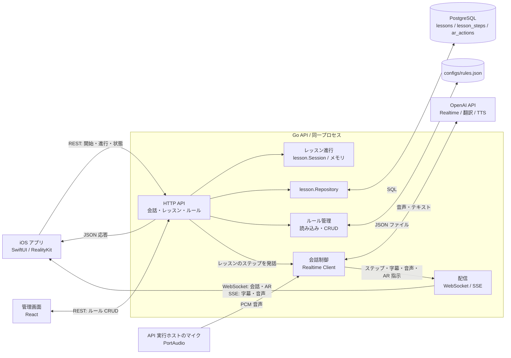

# システム構成

以下は `services/api/cmd/voice-chat` を起動したときの構成です。矢印は主な通信方向を示します。

## 読み方

- レッスン定義はPostgreSQLに保存します。開始・進行中の位置は `lesson.Session` を `lesson_id` をキーとしたプロセス内のマップで保持します。複数利用者が同じレッスンを同時に開始すると状態が共有される制約があります。
- iOSはRESTでレッスンを操作し、WebSocketで会話・AR指示、SSEで字幕・音声を受け取ります。ステップ種別に応じてiOS側で再生経路を選び、二重再生を避けています。WebSocketの受信処理は現状、クライアントからの音声送信を処理しません。
- 会話用のマイク入力はGo APIを実行するホストのPortAudioから取得します。現状の構成はiPhone単体で音声入力を完結する構成ではありません。
- 管理画面のルールは `configs/rules.json` に保存します。これはPostgreSQLの3テーブルとは別のデータです。
- `cmd/gemini-test` にはGemini + TTSの別実行モードがあります。この図は主経路の `cmd/voice-chat` を対象としています。

関連図: [ER図](data-model.md) · [レッスン進行のUMLシーケンス図](lesson-sequence.md)
